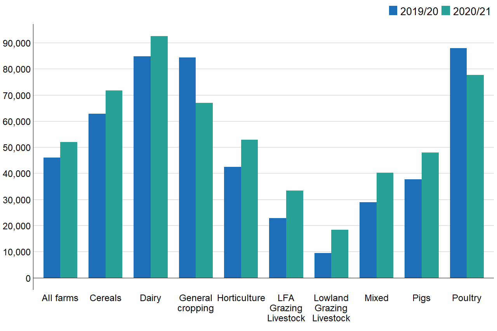
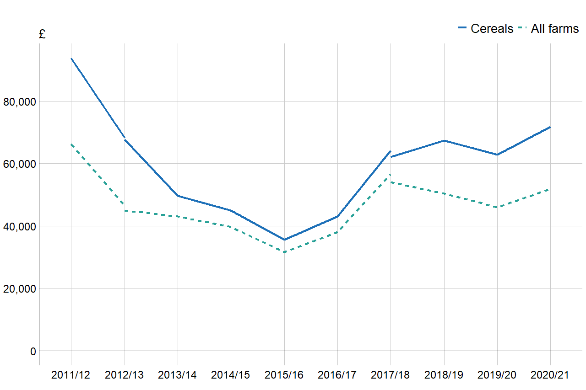
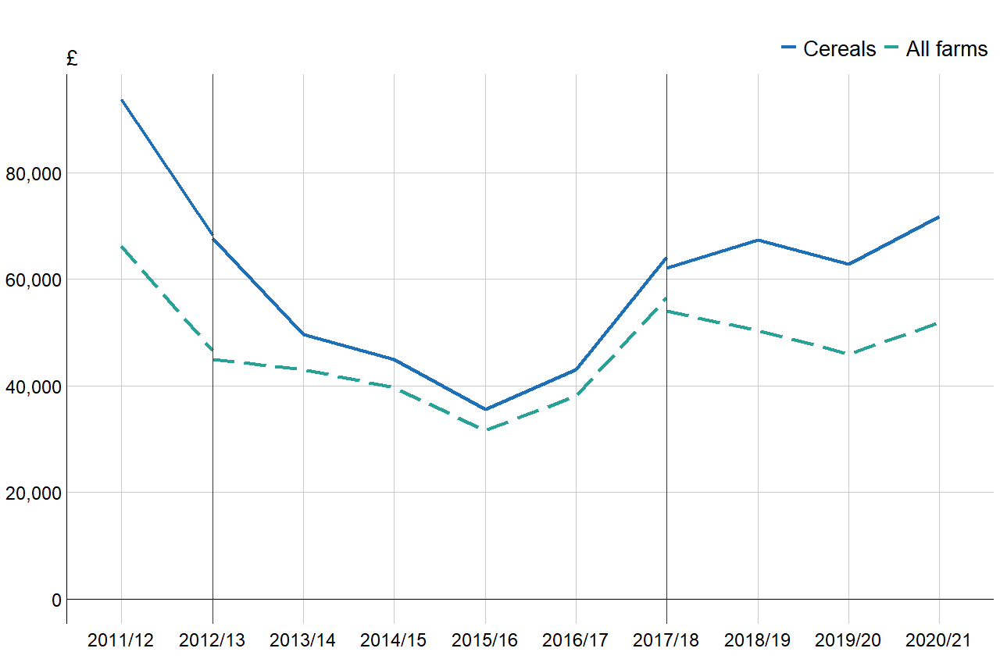
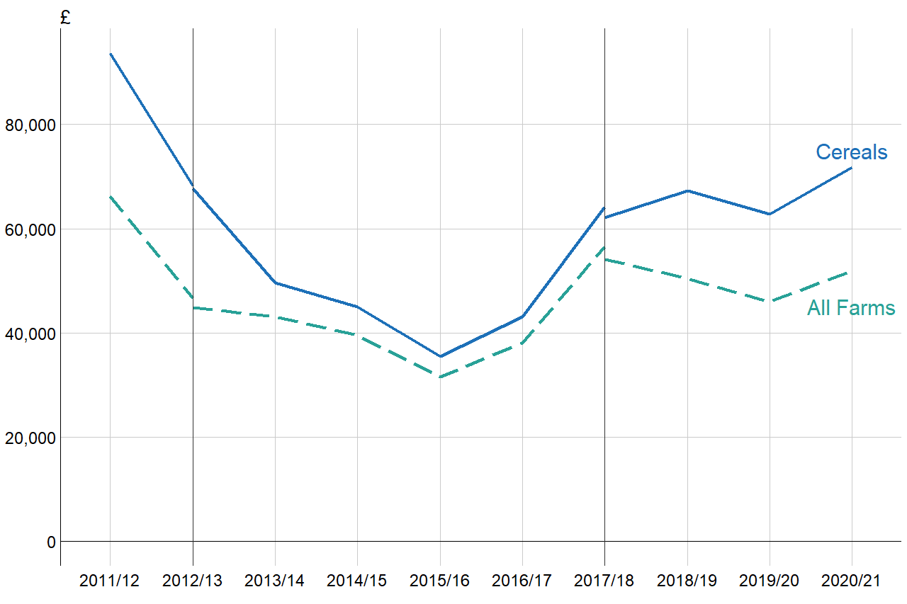
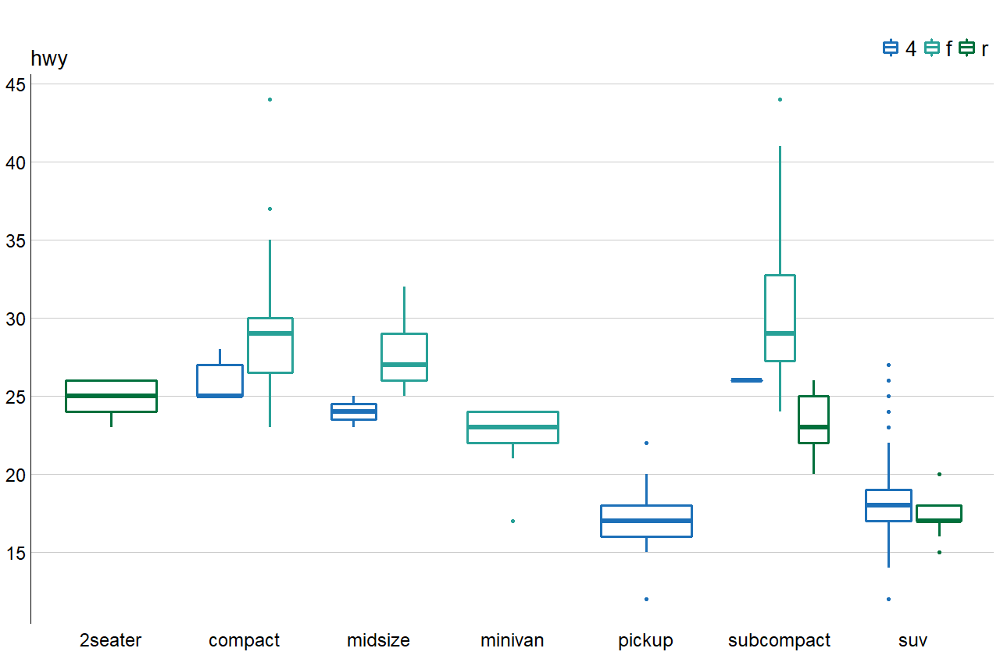

## ggfbs

ggfbs is a package containing convenient functions to create publication ready charts with Defra's Farm Business Survey (FBS) style. This package was built with and designed to work in conjunction with [ggplot2](https://ggplot2.tidyverse.org/) and provides a set of templates to create basic chart whilst also allowing a deep level of customisation.

### Other FBS tools

Along with ggfbs, the FBS team has developed several tools for working with FBS data and to aid in the implemtations of Reproducible Analytical Pipelines (RAP).

* [rgovspeak](https://github.com/Defra-Data-Science-Centre-of-Excellence/rgovspeak): Adds govspeak markdown template to rmarkdown and provide html render functionality to preview your page as if it were published on gov.uk.  
* [FBSCore](https://github.com/Defra-Data-Science-Centre-of-Excellence/FBSCore ): Core functions for extracting and working with FBS data. A full package reference is also available [here](http://fbs.int.sce.network/shiny/fbscore/).

## Installation

If you have a http proxy setup and have created a [personal access token](https://docs.github.com/en/authentication/keeping-your-account-and-data-secure/creating-a-personal-access-token), install the package through R, replacing `my_token` with your personal access token.

```r
devtools::install_github("Defra-Data-Science-Centre-of-Excellence/ggfbs", auth_token = "my_token")
```

Otherwise, download the latest release and install the package in R using:

```r
install.packages("~/Downloads/ggfbs.zip", repos=NULL)
```

## Usage

There are three main ways this package may be used:

1. Utilise the in built templates to create basic charts.
2. Combine the basic templates with other ggplot layers for further customisation.
3. Forego the templates and apply the styling to any ggplot object through the use of `theme_fbs()` and the `scale_*_govuk()` set of functions.

### Basic Chart Templates

```r
# Load libraries
library(dplyr)
library(ggplot2)
library(ggfbs)

# Read in some data
fbi_data <- read.csv("fbi-data.csv", row.names = FALSE)

# Manipulate dataset
plot_data <- fbi_data %>% 
  filter(variable == "Farm Business Income", fbsyear %in% c("2019/20", "2020/21"))
  
# Create basic grouped bar plot
plot_data %>% 
  fbs_barplot(aes(x = factor_name, y = mean, fill = fbsyear))
```
<!-- -->

### Customise with ggplot2

ggfbs allows extensive customisation by adding additional ggplot2 layers to your charts. Here an extension of `fbs_lineplot()` is shown.

Firstly, we will create a basic time series comparing the Farm Business Income of Cereal farms with the overall average.

```r
p <- plot_data %>% 
  fbs_lineplot(
    aes(x = fbsyear, y = mean, group = interaction(factor_name, typology), 
        colour = factor_name, linetype = factor_name),
    value_name = "£"
  )
  
p
```
<!-- -->

Now that we have the basic line plot, we can see that we have two series breaks. Here it might be useful to add two vertical lines to highlight these breaks.

We can also change the types of lines displayed by added a scale.

```r
p2 <- p +
  geom_vline(xintercept = c("2012/13", "2017/18"), colour = "#333333")  +
  scale_linetype_manual(values = c("solid", "longdash"))
  
p2
```
<!-- -->

When creating a line chart, it is sometimes preferable to omit the legend and instead label the lines directly.

Here we set the `legend_hide` argument to `TRUE` within `fbs_lineplot()` and create two annotation layers, allowing us to finely control the position and size of the label. Additionally, to ensure consistency with our theme, we use the `govuk_cols()` helper function to match the colours of the text to those of the lines.

```r
p3 <- plot_data %>% 
  fbs_lineplot(
    aes(x = fbsyear, y = mean, group = interaction(factor_name, typology), 
        colour = factor_name, linetype = factor_name),
    value_name = "£",
    legend_hide = TRUE
  ) +
  geom_vline(xintercept = c("2012/13", "2017/18"), colour = "#4d4d4d") +
  scale_linetype_manual(values = c("solid", "longdash")) +
  annotate(
    "text", 
    x = 11,
    y = 75000,
    label = "Cereals",
    size = 8,
    colour = govuk_cols(1)
  ) +
  annotate(
    "text",
    x = 11,
    y = 45000,
    label = "All Farms",
    size = 8,
    colour = govuk_cols(2)
    )

p3
```
<!-- -->

### Apply styling to your own charts

Alternatively, to apply the FBS theming to chart types not included in the templates, apply `theme_fbs()` in conjunction with one of the govuk scales.

```r
p4 <- ggplot(mpg, aes(class, hwy, colour = drv)) + 
  geom_boxplot(size = 1.2) +
  scale_color_govuk() +
  scale_y_continuous(breaks = scales::pretty_breaks(6)) +
  theme_fbs()

p4
```
<!-- -->

## Export Chart

by default the theme applied to the charts within this package is optimised for publication on gov.uk. For the charts to output correctly the size and dpi of the charts must be set to:

- wdith: 960
- height: 640
- dpi: 72

### 1. Working in Rmarkdown:

Set each chunk option using the options bellow (ignoring the #):
```
# ```{r, fig.width=960/72, fig.height=640/72, dpi=72}
```

Or set all the chunks to output in the same format by adding the code below to the setup chunk
```r
knitr::opts_chunk$set(
  fig.width=960 / 72,
  fig.height=640 / 72,
  dpi=72
)
```

### 2. Save your chart

Use the `ggsave()` function as below to save your plot.

```r
p <- plot_data %>% 
  fbs_barplot(aes(x = factor_name, y = mean, fill = fbsyear))

ggsave("bar-plot.png", p, width = 960/72, height = 640/72, dpi = 72)
```

### 3. Use the `text_scale` arguement:

All templates allow you to scale the size of the text up or down through the `text_scale` argument. e.g. setting `text_scale` to `0.5` reduced the size of the text by 50%. These charts can then be exported through any of the usual methods.

## Help and Resources
Data visualisation and ggplot2

https://ggplot2.tidyverse.org/index.html  
https://r-graphics.org/

Coding in R and programming with ggplot2

https://r4ds.had.co.nz/  
https://ggplot2-book.org/index.html
